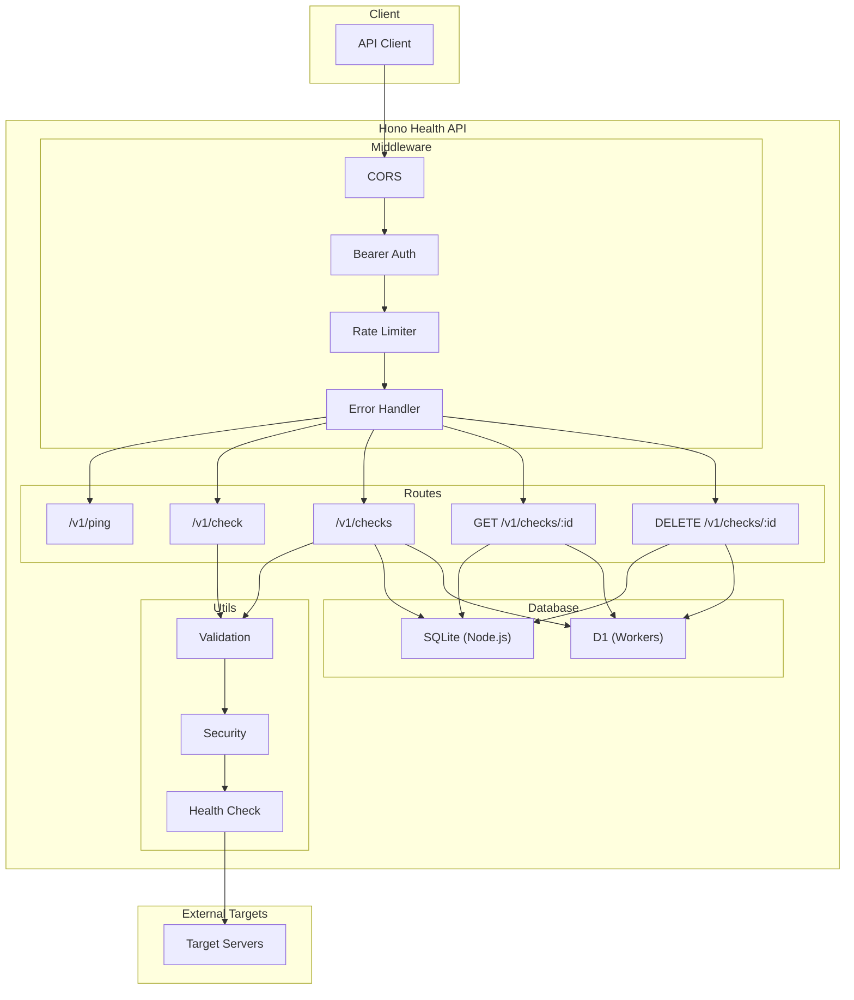
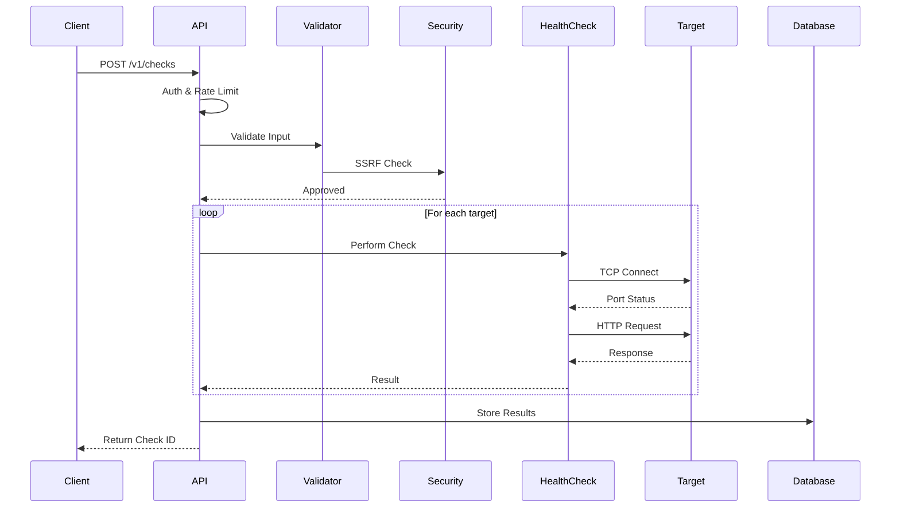

# Hono Health API

A high-performance health check API built with [Hono](https://hono.dev/), supporting both Node.js and Cloudflare Workers runtimes.

## Features

- 🚀 **Dual Runtime**: Runs on Node.js (with better-sqlite3) and Cloudflare Workers (with D1)
- 🔍 **HTTP Health Checks**: Verify endpoints are responding with expected status codes
- 🔌 **TCP Port Checks**: Test if ports are open and accepting connections (Node.js only)
- 🌐 **Subdomain Support**: Check health of subdomains like `api.example.com`
- 📁 **Path Support**: Check specific paths like `/api/v1/health`
- 🔒 **API Token Authentication**: Secure your endpoints with Bearer tokens
- ⏱️ **Rate Limiting**: Built-in rate limiting with configurable limits
- 💾 **Persistent Storage**: Store check results in SQLite/D1 for later retrieval
- 🛡️ **SSRF Protection**: Blocks requests to private IP ranges by default

## Quick Start

### Prerequisites

- Node.js 18+ (for Node.js runtime)
- pnpm (recommended) or npm

### Installation

```bash
pnpm install
```

### Configuration

Copy `.env.example` to `.env` and configure:

```env
PORT=3000
DB_URL=file:./data/app.db
API_TOKEN=your-secure-api-token-here
RATE_LIMIT_WINDOW_MS=60000
RATE_LIMIT_MAX_REQUESTS=100
MAX_TARGETS_PER_REQUEST=10
TCP_TIMEOUT_MS=5000
HTTP_TIMEOUT_MS=10000
```

### Running

```bash
# Development (Node.js)
pnpm run dev:node

# Development (Workers - requires wrangler)
pnpm run dev:worker

# Build for production
pnpm run build
```

## API Reference

All endpoints require authentication via Bearer token:

```
Authorization: Bearer <your-api-token>
```

### Ping

Check if the API is running.

```http
GET /v1/ping
```

**Response:**
```json
{
  "success": true,
  "data": {
    "message": "pong",
    "timestamp": "2024-01-01T00:00:00.000Z",
    "mode": "node"
  }
}
```

### Quick Check (No Storage)

Perform health checks without storing results.

```http
POST /v1/check
Content-Type: application/json
```

**Request Body:**
```json
{
  "targets": [
    {
      "host": "example.com",
      "port": 443,
      "protocol": "https",
      "subdomain": "api",
      "path": "/v1/health",
      "method": "HEAD",
      "timeout": 5000,
      "checkTcp": true
    }
  ]
}
```

**Response:**
```json
{
  "success": true,
  "data": {
    "results": [
      {
        "target": {
          "host": "example.com",
          "port": 443,
          "protocol": "https",
          "subdomain": "api",
          "path": "/v1/health"
        },
        "isAlive": true,
        "portAlive": true,
        "http": {
          "statusCode": 200,
          "statusText": "OK",
          "responseTimeMs": 150
        },
        "tcp": {
          "connected": true,
          "responseTimeMs": 45
        },
        "totalMs": 200,
        "checkedAt": "2024-01-01T00:00:00.000Z"
      }
    ]
  }
}
```

### Check & Store

Perform health checks and store results for later retrieval.

```http
POST /v1/checks
Content-Type: application/json
```

**Request Body:** Same as `/v1/check`

**Response:**
```json
{
  "success": true,
  "data": {
    "id": "550e8400-e29b-41d4-a716-446655440000",
    "status": "completed",
    "targetsCount": 1,
    "createdAt": "2024-01-01T00:00:00.000Z"
  }
}
```

### Get Stored Results

Retrieve previously stored check results.

```http
GET /v1/checks/:id
```

**Response:** Full check results including all target check details.

### Delete Stored Results

Delete a stored check and its results.

```http
DELETE /v1/checks/:id
```

**Response:**
```json
{
  "success": true,
  "data": {
    "message": "Check deleted successfully",
    "id": "550e8400-e29b-41d4-a716-446655440000"
  }
}
```

## Target Configuration

| Field | Type | Default | Description |
|-------|------|---------|-------------|
| `host` | string | *required* | Domain or IP address |
| `port` | number | 443 | Port number (1-65535) |
| `protocol` | string | "https" | "http" or "https" |
| `subdomain` | string | - | Optional subdomain (e.g., "api" → "api.example.com") |
| `path` | string | "/" | URL path to check |
| `method` | string | "HEAD" | HTTP method (GET, HEAD, POST, PUT, DELETE) |
| `timeout` | number | 10000 | Request timeout in milliseconds |
| `checkTcp` | boolean | true | Perform TCP port check |

## Examples

### Check a Domain

```bash
curl -X POST http://localhost:3000/v1/check \
  -H "Content-Type: application/json" \
  -H "Authorization: Bearer your-api-token" \
  -d '{
    "targets": [
      { "host": "google.com", "port": 443, "protocol": "https" }
    ]
  }'
```

### Check Subdomain with Path

```bash
curl -X POST http://localhost:3000/v1/check \
  -H "Content-Type: application/json" \
  -H "Authorization: Bearer your-api-token" \
  -d '{
    "targets": [
      {
        "host": "example.com",
        "port": 443,
        "protocol": "https",
        "subdomain": "api",
        "path": "/v1/status"
      }
    ]
  }'
```

### Check Multiple Targets

```bash
curl -X POST http://localhost:3000/v1/check \
  -H "Content-Type: application/json" \
  -H "Authorization: Bearer your-api-token" \
  -d '{
    "targets": [
      { "host": "github.com", "port": 443, "protocol": "https" },
      { "host": "gitlab.com", "port": 443, "protocol": "https" },
      { "host": "bitbucket.org", "port": 443, "protocol": "https" }
    ]
  }'
```

## Rate Limits

Default rate limits:
- **100 requests** per **60 seconds** per IP

Rate limit headers are included in all responses:
- `X-RateLimit-Limit`: Maximum requests allowed
- `X-RateLimit-Remaining`: Requests remaining in window
- `X-RateLimit-Reset`: Unix timestamp when the window resets

## Error Responses

All errors follow this format:

```json
{
  "success": false,
  "error": {
    "message": "Error description",
    "code": "ERROR_CODE"
  }
}
```

Common error codes:
- `UNAUTHORIZED`: Missing or invalid API token
- `RATE_LIMIT_EXCEEDED`: Too many requests
- `VALIDATION_ERROR`: Invalid request body
- `SSRF_VIOLATION`: Attempted to access private IP
- `NOT_FOUND`: Resource not found

## Securing the /data/ Path

The `/data/` directory contains the SQLite database file. It's important to protect this path from public access.

<details>
<summary><b>🔶 Cloudflare Workers</b></summary>

In Cloudflare Workers, the `/data/` path doesn't exist as files are not served directly. However, if you're using Cloudflare Pages or need to block specific paths:

**Option 1: Using `_routes.json` (Cloudflare Pages)**

Create `public/_routes.json`:
```json
{
  "version": 1,
  "exclude": ["/data/*"]
}
```

**Option 2: Block in Worker code**

Add middleware in your worker:
```typescript
import { Hono } from 'hono'

const app = new Hono()

// Block /data/ path
app.use('/data/*', (c) => {
  return c.text('Forbidden', 403)
})
```

**Option 3: Cloudflare WAF Rules**

In Cloudflare Dashboard → Security → WAF → Custom Rules:
```
(http.request.uri.path contains "/data/")
```
Action: **Block**

</details>

<details>
<summary><b>🟢 Nginx</b></summary>

Add to your Nginx server block:

```nginx
server {
    listen 80;
    server_name yourdomain.com;

    # Block access to /data/ directory
    location /data/ {
        deny all;
        return 403;
    }

    # Alternative: Return 404 (hide existence)
    location /data/ {
        return 404;
    }

    # Block specific file types in data directory
    location ~* ^/data/.*\.(db|sqlite|sqlite3)$ {
        deny all;
        return 403;
    }

    # Your main application
    location / {
        proxy_pass http://localhost:3000;
        proxy_http_version 1.1;
        proxy_set_header Upgrade $http_upgrade;
        proxy_set_header Connection 'upgrade';
        proxy_set_header Host $host;
        proxy_cache_bypass $http_upgrade;
    }
}
```

Reload Nginx:
```bash
sudo nginx -t && sudo systemctl reload nginx
```

</details>

<details>
<summary><b>🟠 Apache (.htaccess)</b></summary>

Create or edit `.htaccess` in your project root:

```apache
# Block access to /data/ directory
<IfModule mod_rewrite.c>
    RewriteEngine On
    RewriteRule ^data(/.*)?$ - [F,L]
</IfModule>

# Alternative: Using Directory directive
<Directory "/path/to/your/project/data">
    Order deny,allow
    Deny from all
</Directory>

# Block specific file extensions
<FilesMatch "\.(db|sqlite|sqlite3)$">
    Order allow,deny
    Deny from all
</FilesMatch>
```

**For Apache virtual host configuration:**

```apache
<VirtualHost *:80>
    ServerName yourdomain.com
    DocumentRoot /var/www/html

    # Block /data/ directory
    <Location /data>
        Order deny,allow
        Deny from all
    </Location>

    # Or return 404
    <Location /data>
        Redirect 404 /
    </Location>
</VirtualHost>
```

Restart Apache:
```bash
sudo apachectl configtest && sudo systemctl restart apache2
```

</details>

<details>
<summary><b>🔵 Docker / Node.js (Express/Hono)</b></summary>

If serving static files, ensure `/data/` is excluded:

```typescript
import { Hono } from 'hono'
import { serveStatic } from 'hono/serve-static'

const app = new Hono()

// Block /data/ before static serving
app.use('/data/*', (c) => {
  return c.json({ error: 'Forbidden' }, 403)
})

// Serve static files (excluding /data/)
app.use('/*', serveStatic({ root: './public' }))
```

**Best Practice:** Don't put the `data/` folder in a publicly served directory. Keep it outside your web root:

```
project/
├── data/          # ← Outside public folder
│   └── app.db
├── public/        # ← Web root
│   └── index.html
└── src/
```

</details>

## Deploy to Cloudflare Workers

### Prerequisites

- [Cloudflare account](https://dash.cloudflare.com/sign-up)
- [Wrangler CLI](https://developers.cloudflare.com/workers/wrangler/install-and-update/) installed

### Option 1: Deploy via Wrangler CLI

#### 1. Login to Cloudflare

```bash
npx wrangler login
```

#### 2. Create D1 Database

```bash
# Create the database
npx wrangler d1 create domain-health

# Copy the database_id from output and update wrangler.toml
```

#### 3. Update `wrangler.toml`

Replace placeholder IDs with your actual values:

```toml
[[d1_databases]]
binding = "DB"
database_name = "domain-health"
database_id = "your-actual-database-id"  # From step 2
```

#### 4. Run Database Migrations

```bash
npx wrangler d1 execute domain-health --remote --file=./drizzle/0000_init.sql
```

#### 5. Set API Token Secret

```bash
npx wrangler secret put API_TOKEN
# Enter your secure API token when prompted
```

#### 6. Deploy

```bash
# Deploy to production
pnpm run deploy:worker
# or
npx wrangler deploy
```

Your API will be available at `https://hono-health-api.<your-subdomain>.workers.dev`

### Option 2: Deploy via GitHub Actions

#### 1. Create GitHub Repository

Push your code to a GitHub repository.

#### 2. Add Repository Secrets

Go to **Settings → Secrets and variables → Actions** and add:

| Secret Name | Value |
|-------------|-------|
| `CLOUDFLARE_API_TOKEN` | [Create API Token](https://dash.cloudflare.com/profile/api-tokens) with "Edit Cloudflare Workers" permission |
| `CLOUDFLARE_ACCOUNT_ID` | Found in Workers & Pages dashboard |
| `API_TOKEN` | Your secure API token for the health check API |

#### 3. Create Workflow File

Create `.github/workflows/deploy.yml`:

```yaml
name: Deploy to Cloudflare Workers

on:
  push:
    branches:
      - main

jobs:
  deploy:
    runs-on: ubuntu-latest
    name: Deploy
    steps:
      - uses: actions/checkout@v4

      - name: Setup Node.js
        uses: actions/setup-node@v4
        with:
          node-version: '20'

      - name: Install pnpm
        uses: pnpm/action-setup@v2
        with:
          version: 9

      - name: Install dependencies
        run: pnpm install

      - name: Deploy to Cloudflare Workers
        uses: cloudflare/wrangler-action@v3
        with:
          apiToken: ${{ secrets.CLOUDFLARE_API_TOKEN }}
          accountId: ${{ secrets.CLOUDFLARE_ACCOUNT_ID }}
          secrets: |
            API_TOKEN
        env:
          API_TOKEN: ${{ secrets.API_TOKEN }}
```

#### 4. Push to Deploy

```bash
git add .
git commit -m "Add GitHub Actions workflow"
git push origin main
```

The workflow will automatically deploy on every push to `main`.

### Local Development (Workers)

```bash
# Start local Workers dev server
pnpm run dev:worker

# This uses wrangler dev with local D1
```

### Environment Variables (Workers)

Set via `wrangler.toml` (non-sensitive) or `wrangler secret` (sensitive):

| Variable | How to Set | Description |
|----------|-----------|-------------|
| `API_TOKEN` | `wrangler secret put API_TOKEN` | API authentication token |
| `MAX_TARGETS_PER_REQUEST` | `wrangler.toml` [vars] | Max targets per request |
| `RATE_LIMIT_WINDOW_MS` | `wrangler.toml` [vars] | Rate limit window |
| `RATE_LIMIT_MAX_REQUESTS` | `wrangler.toml` [vars] | Max requests per window |

## Project Structure

```
hono-health-api/
├── src/
│   ├── app.ts                 # Main Hono application with routes
│   ├── index.node.ts          # Node.js entry point
│   ├── index.worker.ts        # Cloudflare Workers entry point
│   ├── db/
│   │   ├── index.ts           # Database adapter (SQLite/D1)
│   │   ├── schema.ts          # Drizzle ORM schema
│   │   └── migrate.node.ts    # Node.js migration script
│   ├── middleware/
│   │   └── errorHandler.ts    # Error handling middleware
│   ├── types/
│   │   └── index.ts           # TypeScript interfaces
│   └── utils/
│       ├── healthCheck.ts     # HTTP/TCP health check logic
│       ├── security.ts        # SSRF protection & validation
│       └── validation.ts      # Zod schemas & input validation
├── data/
│   └── app.db                 # SQLite database (Node.js)
├── drizzle/
│   └── *.sql                  # Generated migrations
├── .env.example               # Environment variables template
├── drizzle.config.ts          # Drizzle Kit configuration
├── package.json               # Dependencies & scripts
├── tsconfig.json              # TypeScript configuration
├── wrangler.toml              # Cloudflare Workers configuration
├── Dockerfile                 # Docker build configuration
└── docker-compose.yml         # Docker Compose setup
```

## Architecture



## Request Flow



## Credits

This project was built with the assistance of AI:

| Contribution | AI Model | Tool |
|--------------|----------|------|
| 🏗️ Initial Build | **Kimi K2.5 Thinking** | Agent Website |
| 🔒 Error Fixes & Security | **Claude Opus 4.5 (Thinking)** | Antigravity IDE |
| ♻️ Refactoring | **Claude Opus 4.5 (Thinking)** | Antigravity IDE |

Human oversight and manual review by the project maintainer.

## License

MIT
